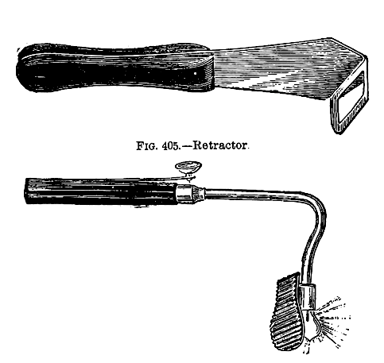

# E2E Testing for React Apps

Retractor exposes the internals of a React application for end-to-end testing purposes. This allows you to select DOM nodes based on the name of the React Component that rendered the node as well as its state or properties.


> A retractor is a surgical instrument with which a surgeon can either actively separate the edges of a surgical incision or wound, or can hold back underlying organs and tissues, so that body parts under the incision may be accessed. – [Wikipedia][1]



## Installation

```javascript
npm install --save retractor
```

## Usage
Retractor consists out of two parts - a client and a query module. The client needs to be integrated in your React App (SUT) to expose its internal component structure. The query module provides [selenium-webdriver][2] locators to query the client API.

### Client
To setup the client module you must load _retractor_ before React gets loaded. In [webpack][3] you can use an entry like this:

```javascript
module.exports = {
  entry: [
    'retractor/client',
    './index' //your application entry
  ],
  output: {},
  plugins: [],
  module: {
    loaders: []
  }
}
```
### Query
Once the _retractor_ client module is integrated in your React Application you can easily use the selenium webdriver to query your components in your tests like this:

```javascript
/* eslint-env mocha */

import React from 'react'
import {one} from 'retractor'
import expect from 'unexpected'
import webdriver from 'selenium-webdriver'

import TodoItem from '../components/TodoItem'

describe('Retractor E2E testing', function() {

  let driver

  before(function() {
    driver = new webdriver.Builder()
    .forBrowser('firefox')
    .build()
  })

  it('query components', function() {
    driver.get('http://localhost:3000/')

    const el = driver.findElement(one(
      <TodoItem todo={{ text: 'Use retractor' }} />
    ))

    return expect(el, 'when fulfilled', 'to be a', webdriver.WebElement)
  })
})
```

## API

### Client
##### `findAllComponents(name? : String, filter? : Object) : Array<Component>`

##### `findOneComponent(name? : String, filter? : Object) : Array<Component>`

##### `findAllDOMNodes(name? : String, filter? : Object) : Array<Element>`

##### `findOneDOMNode(name? : String, filter? : Object) : Array<Element>`


[1]: https://en.wikipedia.org/wiki/Retractor_(medical)
[2]: https://github.com/SeleniumHQ/selenium
[3]: https://github.com/webpack/webpack
